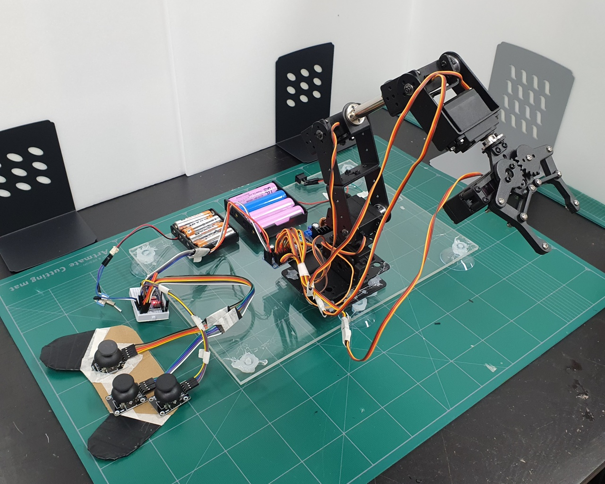

# Robot Arm

version 1.1

## File Structure

- [`로봇팔 정보`](src/로봇팔%20부위-모터%20정보.md) : 로봇팔관련 정보값 모음자료(각도, 상수값, 길이, 등등)
- [`Joystick Control`](src/code-joystick/code-joystick.ino) : 조이스틱(6축)으로 각 모터 조종하는 코드
- [`Serial Control`](src/code-serial/code-serial.ino) : 시리얼 입력으로 각 모터 조종하는 코드
- [`Test Code w/ Serial`](src/test-servo-drive/test-servo-drive.ino) : 시리얼 입력으로 드라이버 조종 테스트 코드
