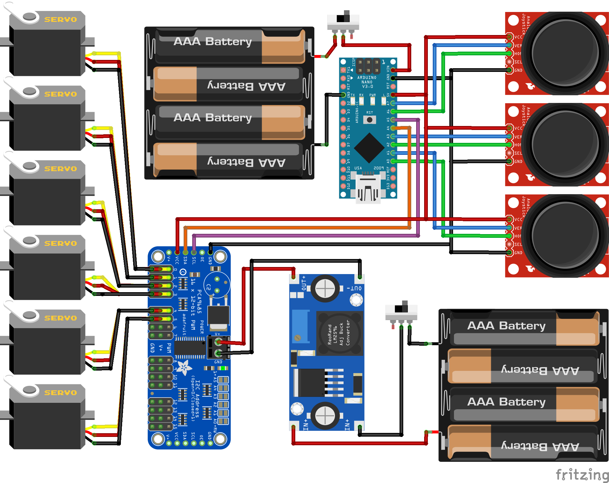

# Robot-Arm Structure

## 전체 연결 구조도

## 부품 종류

- 프로세서
  - Arduino Nano x1
- 출력부
  - 서보모터(MG966R) x6
  - 서보드라이버(PCA9685) x1
- 입력부
  - 조이스틱 2축 x3
- 전원관련
  - 스위치 x2
  - DC-DC 스템다운 컨버터/레귤레이터(XL4016E1) x1
  - 배터리(AA 1.5V, 아두이노 전원용) x4
  - 리튬이온배터리(3.7V-2000mAh, 모터 전원용) x4
